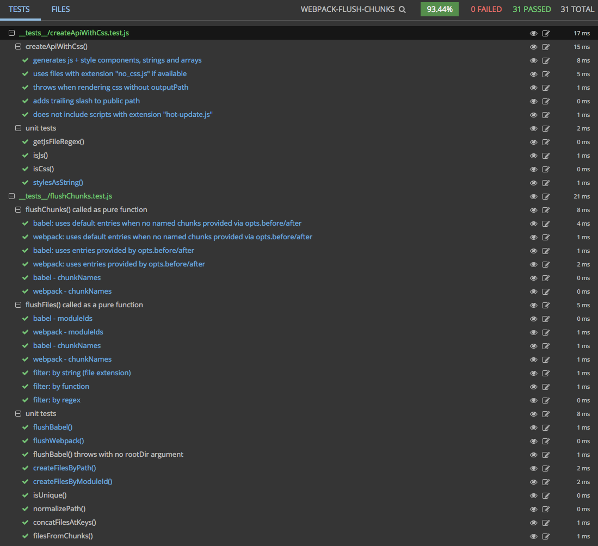

<p align="center">
  <a href="https://www.npmjs.com/package/webpack-flush-chunks">
    
  </a>

  <a href="https://travis-ci.org/faceyspacey/webpack-flush-chunks">
    
  </a>

  <a href="https://lima.codeclimate.com/github/faceyspacey/webpack-flush-chunks/coverage">
    
  </a>

  <a href="https://greenkeeper.io">
    
  </a>

  <a href="https://lima.codeclimate.com/github/faceyspacey/webpack-flush-chunks">
    
  </a>

  <a href="https://www.npmjs.com/package/webpack-flush-chunks">
    
  </a>

  <a href="https://www.npmjs.com/package/webpack-flush-chunks">
    
  </a>

  <a href="https://gitter.im/webpack-flush-chunks">
    
  </a>
</p>

# webpack-flush-chunks
`flushChunks` is the equivalent of `renderToString` or `renderToStaticMarkup` when it comes to code-splitting. It's to be used in
server-rendering to extract the minimal amount of chunks to send to the client, thereby solving a missing piece for code-splitting:
server-side rendering. 

It's a companion package to ***React Loadable*** or any code splitting package that flushes an array of modules rendered on the server.

The dream of **code-splitting everywhere** is finally here.

## Installation

```
yarn add react-loadable webpack-flush-chunks 
```

Optionally to generate multiple CSS files for each chunk (with HMR!) install:
```
yarn add --dev extract-css-chunks-webpack-plugin
```

***Extract CSS Chunk*** is another companion package made to complete the CSS side of the code-splitting dream. To learn more visit: [faceyspacey/extract-css-chunks-webpack-plugin](https://github.com/faceyspacey/extract-css-chunks-webpack-plugin)

*...if you like to move fast, feel free to simply clone & run the [boilerplate](https://github.com/faceyspacey/flush-chunks-boilerplate).*


## Motivation
React can syncronously render itself in one go on the server. However, to do so on the client requires all the chunks used to perform that render, 
which obviously is different for each unique URL, authenticated user, etc. While additional asynchcronous requests triggered as the user 
navigates your app is what code-splitting is all about, it's sub-optimal to have to load additional chunks in the initial render. Similarly, you 
don't want to just send all the chunks down to the client for that initial request, as that defeats the purpose of *code-splitting.* In additition, 
if your strategy is the former, *checksums* won't match and an additional unnecessary render will happen on the client.

As a result, the goal becomes to get to the client precisely those chunks used in the first render, no more, no less. `flushChunks` does exactly 
this, providing strings containing those scripts and stylesheets you can embed in your response:

```javascript
const app = ReactDOM.renderToString(<App />)
const moduleIds = ReactLoadable.flushRequires()
const { js, styles } = flushChunks(moduleIds, stats)
```

If you can provide these chunks to the client, *React Lodable* (or comparable) will perform the first render synchcronously just like the server.

## How It Works
*React Loadable*, when used on the server, skips the *loading* phase and syncronously renders your contained component, while recording the ID of 
its corresponding module. *React Loadable* may be used multiple times and therefore may record multiple split points. `flushChunks` is then able 
to determine the minimal set of chunks required to re-render those modules/components on the client. From there it outputs strings or React components 
containing the precise javascript files (and CSS files) to embed in your HTML response. 

The result is a server-rendered response whose *"checksum"* 
matches the one generated on the client, so that another client render is not needed, and more importantly so that another request to the server for
an additional chunk is not needed. Until now, code-splitting has been possible with webpack, but at the expense of SEO/server-rendering and 
additional latency to retreive more chunks.

Before we examine how to use `flushChunks`, let's take a look at the desired output. It's something like this:

```html
<head>
  <link rel='stylesheet' href='/static/0.css' />
  <link rel='stylesheet' href='/static/7.css' />
  <link rel='stylesheet' href='/static/main.css' />
</head> 

<body>
  <div id="react-root"></div>

  <!-- before entry chunks -->
  <script type='text/javascript' src='/static/bootstrap.js'></script>
  <script type='text/javascript' src='/static/vendor.js'></script>

  <!-- dynamic chunks -->
  <script type='text/javascript' src='/static/0.js'></script>
  <script type='text/javascript' src='/static/7.js'></script>

  <!-- after entry chunks -->
  <script type='text/javascript' src='/static/main.js'></script>
</body>
```

> Notice common `vendor` and `bootstrap` chunks at the beginning and your main entry bundle (`main`) at the end. 
Notice that chunks `0` and `7` are served, but not chunks `1-6`. That's a lot of bytes saved in initial requests!

Because of the way Webpack works where "bootstrap" code must be run before any additional chunks can be registered, 
it's imperative bootstrap and common chunks are generated and placed at the beginning, 
thereby allowing you to place dynamic chunks before your entry chunk which kickstarts app rendering.

In conjunction with your Webpack configuration (which we'll specify [below](#webpack-configuration)), `flushChunks` solves these problems for you by consuming your Webpack compilation `stats` and generating strings and components you can embed in the final output rendered on the server.

## Usage

Call `ReactLoadable.flushRequires` immediately after `ReactDOM.renderToString`, and then pass the returned `moduleIds` plus your Webpack client bundle's 
compilation stats to `flushChunks`. The return object of `flushChunks` will provide several options you can embed in your response string. The easiest is the `js` and `styles` strings: 

```javascript
import ReactDOM from 'react-dom/server'
import ReactLoadable from 'react-loadable'
import flushChunks from 'webpack-flush-chunks'

const app = ReactDOM.renderToString(<App />)
const moduleIds = ReactLoadable.flushRequires()
const { js, styles } = flushChunks(moduleIds, stats)

res.send(`
  <!doctype html>
  <html>
    <body>
      ${styles}
      <div id="root">${app}</div>
      ${js}
    </body>
  </html>
`)
```


**Summary:** By code-splitting extensively in combination with a simple server-side flushing API you can give yourself 
deep control of the amount of bytes you send in your initial request while taking into account server-side rendering. 
Until now, the best you could do is split your app into chunks, but then additional requests on the client were needed 
to get those chunks; and then on top of that the promise of server-side rendering was lost.

## Options API:

```javascript
flushChunks(moduleIds, stats, {
  before: ['bootstrap', 'vendor'],
  after: ['main'],
  rootDir: path.resolve(__dirname, '..'),
  outputPath: path.resolve(__dirname, '../dist'),
})
```

**All options are optional** if you are rendering *both your client and server with webpack* and using the *default 
names* for entry chunks. If you're rendering the server with Babel (and using the default entry names), only `rootDir` 
is required. Here are all possible options:

- **before** - ***array of named entries that come BEFORE your dynamic chunks:*** A typical 
pattern is to create a `vendor` chunk. A better strategy is to create a `vendor` and a `bootstrap` chunk. The "bootstrap"
chunk is a name provided to the `CommonsChunkPlugin` which has no entry point specified for it. The plugin by default removes 
webpack bootstrap code from the named `vendor` common chunk and puts it in the `bootstrap` chunk. This is a common pattern because
the webpack bootstrap code has info about all the chunks/modules used in your bundle and is likely to change, which means to cache
your `vendor` chunk you need to extract the bootstrap code into its own small chunk file. If this is new to you, don't worry.
[Below](#webpack-configuration) you will find examples for exactly how to specify your Webpack config. Lastly, you do not need to 
provide this option if you have a `bootstrap` chunk, or `vendor` chunk or both, as those are the defaults.

- **after** - ***array of named entries that come AFTER your dynamic chunks:*** 
Similar to `before`, `after` contains an array of chunks you want to come after the dynamic chunks that
React Loadable flushes. Typically you have just a `main` chunk, and if that's the case, you can ignore this option,
as that's the default.

- **rootDir** - ***absolute path to the directory containing your package.json file:*** If you are rendering your server code with Webpack as well, this option can be ignored. However, if
you're rendering the server with Babel, you **must** provide the root directory of your app so *React Loadable* can link
modules rendered by Babel on the server to their equivalents rendered by Webpack on the client. So for example, if your
client entry script is `app/src/index.js`, and you're calling `flushChunks` from `app/server/render.js`, you will want 
to pass `path.resolve(__dirname, '..')`, which is essentially `app/`. We recommend you checkout and run the 
[boilerplate]() for a clear example.

- **outputPath** - ***absolute path to the directory containing your client build:*** This is only needed if serving css 
embedded in your served response HTML, rather than links to external stylesheets. *See [below](#3-css-instead-of-stylesheets) 
for how to do this.* It's needed to determine where in the file system to find the CSS that needs to be extract into
an in-memory string. Keep in mind if you're rendering the server with Webpack, filesystem paths may not match up, so it's important
to accurately pass the `outputPath` to your `serverRender` method. We recommend to do this by running your server 
express/koa/hapi/etc code via Babel and then by requiring your Webpack server bundle into it. 
See the [boilerplate](https:github.com/faceyspacey/flush-chunks-boilerplate) for an example.


## Return API:

The return of `flushChunks` provides many options to render server side requests, giving you maximum flexibility:

```javascript
const {
  // react components:
  Js,     // javascript chunks
  Styles, // external stylesheets
  Css,    // raw css

  // strings:
  js,     // javascript chunks
  styles, // external stylesheets
  css,    // raw css

  // arrays of file names:
  scripts,
  stylesheets,

  // important paths:
  publicPath,
  outputPath
} = flushChunks(moduleIds, stats, options)
```

Let's take a look at some examples:


## 1) Generated \<Js /\> + \<Styles /\> components:
```javascript
import React from 'react'
import ReactDOM from 'react-dom/server'
import ReactLoadable from 'react-loadable'
import flushChunks from 'webpack-flush-chunks'
import App from '../src/components/App'

export default function render(stats) {
  return (req, res, next) => {
    const app = ReactDOM.renderToString(<App />)
    const moduleIds = ReactLoadable.flushRequires()

    const { Js, Styles } = flushChunks(moduleIds, stats, {
      before: ['bootstrap', 'vendor'],
      after: ['main'],
    })

    const html = ReactDOM.renderToStaticMarkup(
      <html>
        <body>
          <Styles />
          <div id="root" dangerouslySetInnerHTML={{ __html: app }} />
          <Js />
        </body>
      </html>
    )

    res.send(`<!DOCTYPE html>${html}`)
  }
}
```

> Here the React Components `<JS />` and `<Styles />` are returned from `flushChunks` for use in composing the final component tree passed to `renderToStaticMarkup`. Notice the components are in the `<body>`--this is because until *React 16* container `spans` are needed, and if used in the `<head>` will produce warnings.

This is just one option though. There are several other things **returned** from `flushChunks`, which fulfill most other common needs:


## 2) Strings instead of React Components:
```javascript
const app = ReactDOM.renderToString(<App />)
const moduleIds = ReactLoadable.flushRequires()
const { js, styles } = flushChunks(moduleIds, stats);

res.send(`
  <!doctype html>
  <html>
    <body>
      ${styles}
      <div id="root">${app}</div>
      ${js}
    </body>
  </html>
`)
```
> **note:** notice how no options map was passed to `flushChunks`. That's because the named entry chunks, `bootstrap`, `vendor` and `main`, are looked for by default.


## 3) CSS instead of Stylesheets:
```javascript
const app = ReactDOM.renderToString(<App />)
const moduleIds = ReactLoadable.flushRequires()
const { js, css } = flushChunks(moduleIds, stats, {
  outputPath: '/Users/jamesgillmore/App/dist' // required!
});

res.send(`
  <!doctype html>
  <html>
    <body>
      ${css}
      <div id="root">${app}</div>
      ${js}
    </body>
  </html>
`)
```
> **note:** `<Css />` is available as well if composing another React component tree.


Here the raw css will be inserted into the page, rather than links to external stylesheets. 
To accomplish this, you must provide as an option the `outputPath` of your client webpack bundle.


Also note: during development stylesheets are still used in order to enable HMR. Build your app
with `process.env.NODE_ENV === 'production'` and you will see the raw CSS embeded in your responses.


## 4) Plain Array of Scripts and Stylesheets:
```javascript
const app = ReactDOM.renderToString(<App />)
const moduleIds = ReactLoadable.flushRequires()
const { scripts, stylesheets, publicPath } = flushChunks(moduleIds, stats);

const html = ReactDOM.renderToStaticMarkup(
  <html>
    <head>
      {stylesheets.map(file => (
        <link rel="stylesheet" href={`${publicPath}/${file}`} />
      ))}
    </head>
    <body>
      <div id="root" dangerouslySetInnerHTML={{ __html: app }} />

      {scripts.map(file => (
        <script type="text/javascript" src={`${publicPath}/${file}`} />
      ))}
    </body>
  </html>
)
```
> **note:** the `publicPath` is also returned, for convenience

Though generally you will have no need to manually create your stylesheets and scripts, here you can see what data you have available to you in case you need to perform some other logic
on the array of scripts/sheets returned to you.


## Webpack Configuration

In addition to providing a plethora of options for rendering server-side requests, **Webpack Flush Chunks** has been made to be a complete and comprehensive solution to all the Webpack and Babel bundling/compilation strategies you might take. We got you covered. Let's examine our recommended Webpack configs for a variety of situations:

*NOTE: Parts of your webpack config that either stay the same or are pretty standard will be left out. You can view the 
[boilerplate](https://github.com/faceyspacey/flush-chunks-boilerplate) for complete examples. Below are the relevant parts.* 


## UNIVERSAL WEBPACK (CLIENT + SERVER):

### Client Development
```javascript
const ExtractCssChunks = require('extract-css-chunks-webpack-plugin')

entry: [
  path.resolve(__dirname, '../src/index.js'),
],
module: {
  rules: [
    {
      test: /\.js$/,
      exclude: /node_modules/,
      use: 'babel-loader',
    },
    {
      test: /\.css$/,
      use: ExtractCssChunks.extract({
        use: 'css-loader?modules&localIdentName=[name]__[local]--[hash:base64:5]',
      }),
    },
  ],
},
plugins: [
  new ExtractCssChunks,                      // key to producing CSS chunks -- see below!
  new webpack.NamedModulesPlugin(),         // key to linking server modules to client modules
  new webpack.optimize.CommonsChunkPlugin({
    names: ['bootstrap'],                   // notice there is no "bootstrap" named entry
    filename: '[name].js',
    minChunks: Infinity,
  }),
  ...
```

The key elements above are first the `namedModulesPlugin` which insures the module IDs generated for your
client bundle are the same for your server bundle (aka "deterministic"). Secondly, the `CommonsChunkPlugin` with
`"bootstrap"` entry *which doesn't exist* insures that a separate chunk is created just for webpack bootstrap code. 
This moves the webpack bootstrap code out of your `main` entry chunk so that it can also run before your dynamic
chunks. Lastly, the `ExtractCssChunks` plugin in combination with its loader insures CSS also gets multiple
CSS files created. If you're familiar with how `extract-text-webpack-plugin` works, you will be right at home.


Check out [faceyspacey/extract-css-chunks-webpack-plugin](https://github.com/faceyspacey/extract-css-chunks-webpack-plugin) 
to learn more--it has some advanced features including HMR, and the ability to generate javascript chunks that don't 
contain CSS injection plus simultaneously chunks that do for future asynchronous loading of chunks. I.e. 2 versions
of each javascript chunk.

### Server Development
```javascript
module: {
  rules: [
    {
      test: /\.js$/,
      exclude: /node_modules/,
      use: 'babel-loader',
    },
    {
      test: /\.css$/,
      exclude: /node_modules/,
      use: 'css-loader/locals?modules&localIdentName=[name]__[local]--[hash:base64:5]',
    },
  ],
},
plugins: [
  new webpack.NamedModulesPlugin(),
  new webpack.optimize.LimitChunkCountPlugin({
    maxChunks: 1,   // the server MUST only have one bundle file
  }),
  ...
```

The `LimitChunkCountPlugin` with `maxChunks: 1` insures only one file is generated for your server bundle
so it can be run synchronously. And again `NamedModulesPlugin` insures module IDs with the same names
as your client bundle are flushed.

### Client Production
```javascript
// loaders + entries stay the same
plugins: [
  new ExtractCssChunks,
  new webpack.HashedModuleIdsPlugin(),                // don't expose file system in production bundle
  new webpack.optimize.CommonsChunkPlugin({
    names: ['bootstrap'],
    filename: '[name].[chunkhash].js',
    minChunks: Infinity,
  }),
  new require('stats-webpack-plugin')('stats.json'),  // VERY IMPORTANT! `flushChunks` consumes this
  ...
```

In production `HashedModuleIdsPlugin` is used so that you don't expose your file system for the names
of modules, as `NamedModulesPlugin` creates module IDs like: `'./src/Components/App.js'`.

`stats-webpack-plugin` is instrumental in producing a `stats.json` file in your build directory, from
which stats can be read in production. During development, this is done in code. See [below](#how-to-get-stats-in-development).

### Server Production
```javascript
// loaders + entries stay the same
plugins: [
  new webpack.HashedModuleIdsPlugin(),
  new webpack.optimize.LimitChunkCountPlugin({
    maxChunks: 1,
  }),
  ...
```


## Webpack on the Client and Babel on The Server:
Now, not all of you are using Webpack to compile your server code (although we recommend you do--see our 
[nice universal webpack setup](https://github.com/faceyspacey/flush-chunks-boilerplate) in our boilerplate). So for those that are not, 
here is the configs for your client bundles, and the solution we recommend for handling CSS on the server:


*.babelrc*:
```
{
  "presets": ["es2015", "react", "stage-2"],
  "plugins": ["dynamic-import-webpack", [
     "css-modules-transform", {
       "generateScopedName": "[name]__[local]--[hash:base64:5]"
     }
  ]]
}

```
Since you can't rely on webpack anymore to handle importing CSS, we recommend using 
[babel-plugin-css-modules-transform](https://github.com/michalkvasnicak/babel-plugin-css-modules-transform) 
to generate CSS class names on the server. I.e:

```javascript
import styles from '../css/Foo.css'
export default () => <div className={styles.box} />
```
becomes:
```html
<div class="../css/Foo__box--asdfe" />
```
*And it does so without creating CSS files, as that's handled by Webpack bundling the client code.*

Now that we are using this babel transform, pay close attention to how we must override its `.babelrc` in your client webpack config:

### Client Development
```javascript
entry: [
  path.resolve(__dirname, '../src/index.js'),
],
module: {
  rules: [
    {
      // when building the server with Babel, we must override the babelrc
      // since the babelrc uses "css-modules-transform" which breaks
      // ExtractCssChunks + css-loader:
      test: /\.js$/,
      exclude: /node_modules/,
      use: {
        loader: 'babel-loader',
        options: {
          babelrc: false,
          presets: ['es2015', 'react', 'stage-2'],
          plugins: [
            require('babel-plugin-dynamic-import-webpack').default,
            // notice there is no "css-modules-transform" plugin!
          ],
        },
      },
    },
    {
      test: /\.css$/,
      use: ExtractCssChunks.extract({
        use: 'css-loader?modules&localIdentName=[name]__[local]--[hash:base64:5]',
      }),
    },
  ],
},
plugins: [
  new ExtractCssChunks,
  new webpack.optimize.CommonsChunkPlugin({
    names: ['bootstrap'],
    filename: '[name].js',
    minChunks: Infinity,
  }),
  ...
```

### Client Production
```javascript
// loaders + entries stay the same
plugins: [
  new ExtractCssChunks,
  new webpack.optimize.CommonsChunkPlugin({
    names: ['bootstrap'],
    filename: '[name].[chunkhash].js',
    minChunks: Infinity,
  }),
  new StatsPlugin('stats.json'),
  ...
```


## How to Get Stats in Development

The general premise is to run your webpack compiler in code rather than from the command line. By doing so,
you get access to your client bundle's stats in a callback:

*server/index.js:*
```javascript
import config from '../webpack/client.dev'
import serverRender from './render'

const compiler = webpack(config)
const publicPath = config.output.publicPath

app.use(webpackDevMiddleware(compiler, { publicPath }))
app.use(webpackHotMiddleware(compiler))

// where you get the stats:
compiler.plugin('done', stats => {
  app.use(serverRender(stats.toJson()))
})  
```
> **note:** a callback can be passed to `webpack(config, stats => ...)`, but it does not provide the complete set 
of stats as the `done` plugin callback does. Do NOT use it!

In this case `serverRender` is a function you call once with the stats that returns a function that 
can be used by express on every request:

*server/render.js:*
```javascript
export default stats => {
  return (req, res, next) => {
    const app = ReactDOM.renderToString(<App />)
    const moduleIds = ReactLoadable.flushRequires()
    const { Js Styles} = flushChunks(moduleIds, stats, {
      rootDir: path.resolve(__dirname, '..')
    })
    ...
```

*The above is an example with a Babel server (hence the `rootDir` option). Checkout the [boilerplate](https://github.com/faceyspacey/flush-chunks-boilerplate) to
see it in its entirety, as well as a unique solution we recommend for universal webpack rendering, using [webpack-hot-server-middleware](https://github.com/60frames/webpack-hot-server-middleware) which bundles both the client and the server using a shared cache for faster builds.*


## Boilerplate Example
It should be clear by now that the main work in using `webpack-flush-chunks` is not in application code, but in setting up your
webpack configs. It's therefore extremely important to checkout the [example boilerplate](https://github.com/faceyspacey/flush-chunks-boilerplate). 
After clicking around its files, and running the different setups (development, production, babel server, etc), the above should all make sense,
and you should have a fool-proof place to start from.

ONE FINAL TIME: clone & run [the flush chunks boilerplate](https://github.com/faceyspacey/flush-chunks-boilerplate) before using this package!

## Notes on `extract-css-chunks-webpack-plugin`

In all of the configurations above you may have noticed our focus on CSS plus the `ExtractCssChunks` plugin. This is a very important package that allows you to
serve rendered CSS chunks just as we do javascript chunks. In fact, it's a companion package we specifically made to achieve the dream of server-rendered
code-splitting with *React Loadable* + *Webpack Flush Chunks*. We recommend you check out its [documentation](https://github.com/faceyspacey/extract-css-chunks-webpack-plugin) to learn all about it. 

The short of it is that we remove CSS from your javascript chunks to make it smaller, and move it all into CSS chunk files which `flushChunks` 
handles the same as js, *EXCEPT when you require additional chunks asyncronously on the client after the initial page load, in which case different 
chunks are loaded which inject css as normal*. Woo, that was a long sentence! It also successfully provides HMR features across all your CSS chunks--something the original package
its forked from (`extract-text-webpack-plugin`) does not provide, not even for a single css file.

In terms of server-rendering, it achieves a lot of the same things that solutions like *Aphrodite*
and *StyleTron* achieve where you extract the rendered CSS, *except its JS bundles are a lot smaller since CSS is completely moved to CSS files;* **and it 
doesn't add to your runtime/render-overhead by performing work during render;** ***and it doesn't require cluttering your code with HoCs or specialized components; you can import a styles object just like you can with React Native (therefore you can use the same components for React as RN).*** 
*The list goes on...* We
think we may have stumbled upon a solution that completes the intent of CSS Modules and the value you can derive from it, similar to how *Webpack Flush Chunks* completes the thought of code-splitting for *React Loadable*. It certainly produces the most minimal set of bytes corresponding to CSS
you'll send over the wire in initial requests. You be the judge of that. We look forward to hearing your
opinion.


## Low-level API: `flushFiles`
For advanced users that want all files flushed (`.js`, `.css` or whatever else might be in there) and without named entry chunks (such as `bootstrap`, `vendor`, and `main`), here you go:

```js
import ReactLoadable from 'react-loadable'
import { flushFiles } from 'webpack-flush-chunks'

const moduleIds = ReactLoadable.flushRequires()
const files = flushFiles(moduleIds, stats, /* rootDir if babel */)

const scripts = files.filter(file => /\.js/.test(file))
const styles = files.filter(file => /\.css/.test(file))
```
> i.e. this will get you all files corresponding to flushed "dynamic" chunks, no more

Keep in mind, you will have to get right placing these between your `bootstrap` and `main` scripts. ***OR*** if you don't have a `bootstrap` script, you need to set it up so your `main` script doesn't actually call `ReactDOM.render`, and instead you put `<script>window.render()</script>` (where `window.render()` calls `ReactDOM.render`) after all your chunks in your markup so that by the time it's called all your chunks are loaded. In the latter case, you should put your dynamic chunks received from `flushFiles` **after** your `main` script so that the webpack bootstrap code *now within your `main` script* (as it regularly is) knows what to do with the additional scripts from dynamic chunks.

If what you want is full-on compilation `chunk` objects (and any information it contains, which for 99% of most projects is unnecessary), create an issue and we'll add it. But until there is an actual need, we would like to keep the API simple.


## Contributing

We use [commitizen](https://github.com/commitizen/cz-cli), so run `npm run cm` to make commits. A command-line form will appear, requiring you answer a few questions to automatically produce a nicely formatted commit. Releases, semantic version numbers, tags, changelogs and publishing to NPM will automatically be handled based on these commits thanks to [semantic-release](https://github.com/semantic-release/semantic-release). Be good.


## Tests

Reviewing a module's tests are a great way to get familiar with it. It's direct insight into the capabilities of the given module (if the tests are thorough). What's even better is a screenshot of the tests neatly organized and grouped (you know the whole "a picture says a thousand words" thing). 

Below is a screenshot of this module's tests running in [Wallaby](https://wallabyjs.com) *("An Integrated Continuous Testing Tool for JavaScript")* which everyone in the React community should be using. It's fantastic and has taken my entire workflow to the next level. It re-runs your tests on every change along with comprehensive logging, bi-directional linking to your IDE, in-line code coverage indicators, **and even snapshot comparisons + updates for Jest!** I requestsed that feature by the way :). It's basically a substitute for live-coding that inspires you to test along your journey.

